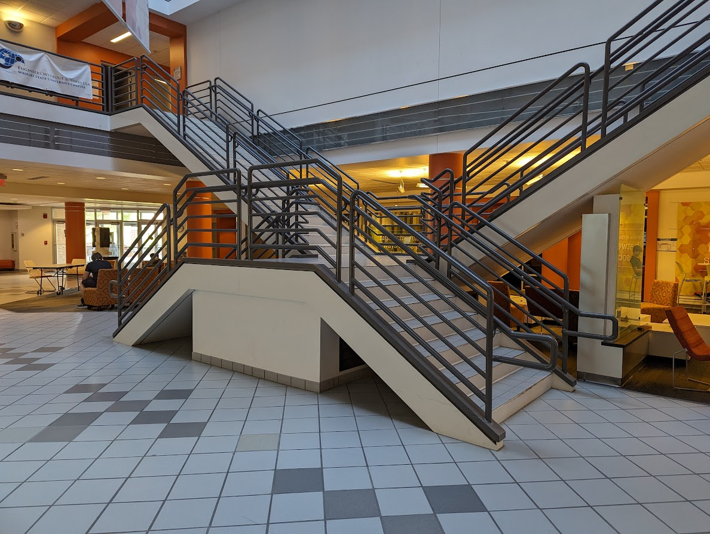

## Project Meetings

**Major Meetings Fridays @ 2PM-4PM in 030 Russ Engineering**  
Watch for Discord event notifications in the WSU CSE / EE Discord server
- [server invite linked on this page](https://engineering-computer-science.wright.edu/computer-science-and-engineering)

## Documentation

The documentation is located [here](documentation/)

## The Goal

Turn the steps of the Russ atrium staircase into an interactive staircase by  
integrating sensors on steps with lights and sounds.

This is a student led, mentor guided project.

## The Plan

This project has spanned Fall 2023 and Spring 2024, and has been reintroduced spanning through Fall 2025 and potentially Spring 2026.  

Outline projects details, break the project into sprints, and learn enough GitHub to do project tracking among participants.

## What Students Get:

- mentorship & experience using tools throughout the sprints above
- a unique token of participation in this Boffin Build Project
- connection with career services to write their experience into resumes

## Sponsors

Support was provided by the Students First Fund of the Wright State University Foundation
