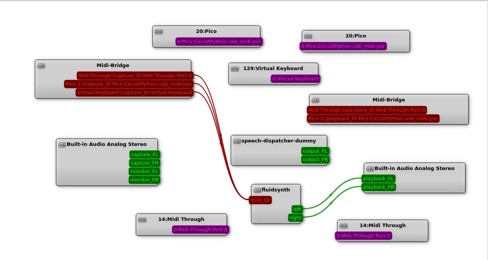

# `./src/`

This folder has a bunch of random demo code from various places (I did not actually write any of this code).

In no particular order: 

### Linux pre-requisite programs

* `fluidsynth/` has some scripts that ended up being useless.  Just install `fluidsynth` and be done with it.
* `qjackctl/` has the configuration image for the required `qjackctl` program.  May require more setup to get
  the right inputs and outputs shown...

### Examples

* `midi-7button-example/` has an example Arduino midi USB library with 7 buttons (not tested fully with the above yet)
* `picopi-midi-example/` has an example Raspberry Pi Pico setup with all required libraries.  Requires a specific 
  pi-pico hat with a 4x4 key matrix (working with the above setup)

### Setup

1. `sudo apt install fluidsynth qjackctl`
2. start and config qjackctl per below (might need fluidsynth running first)
  
  * may need to restart qjackctl
3. start fluidsynth and configure a sound
4. test?
5. Jaws (Duuuummmmmmmmmmmmmmmmmmmmm  dUMM........Duuuummmmmmmmmmmmmmmmmmmmm dUM....)

